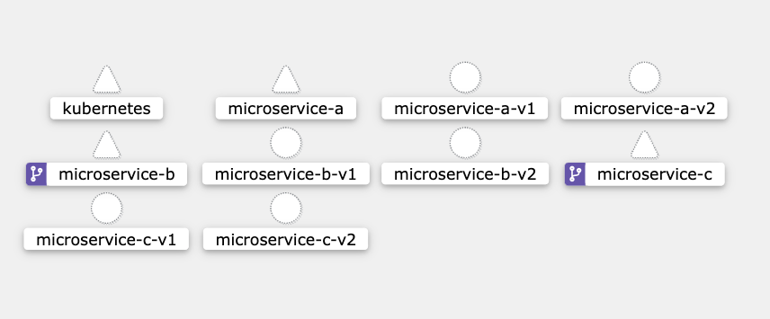
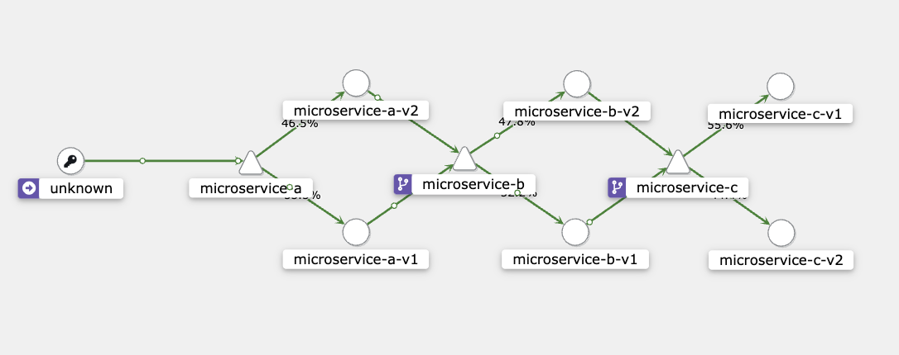

# Microservices Architecture: Seamless Deployment and Communication Synchronization with Kubernetes and Istio

## Overview
In the realm of modern software development, the orchestration of microservices across cloud environments can pose significant challenges, particularly when deploying new versions. Organizations often rely on multiple interdependent services, written in various languages and hosted on cloud platforms like Amazon AWS, each on its own EC2 instance. The introduction of Kubernetes and Istio into this mix revolutionizes the way we handle these complexities.

Consider the challenge of ensuring that, upon a new blue-green or canary deployment, a payment microservice in version 2 should only communicate with other services of the same version. When both old and new versions need to run simultaneously, synchronization becomes crucial. This scenario often raises the question: How can we guarantee that all interactions between microservices are version-appropriate, especially when new versions may require API end-points that previous versions do not support?

## Technologies Used
- **Kubernetes**: This leading container orchestration tool automates the deployment, scaling, and management of containerized applications, simplifying operations across clustered environments.
- **Istio**: This cutting-edge service mesh optimizes service-to-service communication across microservices, enhancing security, connectivity, and monitoring capabilities.
- **Kiali**: A visualization tool that provides insights into the traffic flow and interactions among microservices, facilitating the management of Istio's configurations and ensuring effective rule enforcement.
- **Monitoring and Observability Tools**:
  - **Prometheus & Grafana**: For real-time monitoring and visualization.

## Project Structure
```plaintext
├── cluster-resources         # Deployment related yaml files
├── k8s-dashboard/            # Kubernetes dashboard yaml files
├── microservices/            # Source code for each microservice
│   ├── microservice-a/       # NodeJS containerized microservice that serves as an entry point and calls microservice-b
│   ├── microservice-b/       # Golang containerized microservice that receives request from microservice-a and calls microservice-c
│   └── microservice-c/       # Python containerized microservice that receives request from microservice-b and returns its own 
└── bootstrap.sh              # Script to setup the basic infrastructure from ground up
```
## Before getting started
Before getting started with this project, ensure that you have the following prerequisites installed on your local machine:
- **Docker**: This is a containerization platform used to run applications in isolated environments. It provides an easy way to package and deploy software components.
- **kubectl**: This command line tool allows you to interact with Kubernetes clusters. It's essential for managing deployments, scaling, and monitoring.
- **K3D**: K3D is a lightweight wrapper that runs k3s (a lightweight Kubernetes distribution) in Docker. It's great for local development and testing, providing a quick and easy way to spin up a Kubernetes cluster.

Kubernetes is known to be resource intensive so I recommend at least 4 CPU cores and 8 GB of RAM dedicated to Docker.</br>
I executed this proof of concept on a M1 Max 32GB of RAM but I believe it might work on a smaller machine as well.</br>
As mentioned, it has not been tested on a linux or a WSL 2 environment but I strongly believe it should work. I'll update this note once I run these tests.</br>
I would definately appreciate feedbacks! :-)

Important to remind that, not all of the tools used in this POC are necessary to get the main objective accomplished, so you might want to remove some of them from the bootstrap 
script in case you have a more limited resources machine.

## Main Objetives
- Deploy a local Kubernetes cluster using K3D.
- Deploy an Istio service mesh.
- Setup Kiali to visualize traces between services within the mesh.
- Configure Prometheus to scrape metrics from the microservices deployed in the cluster.
- Setup a Grafana dashboard to visualize metrics and logs from the microservices deployed in the cluster.
- Build and deploy three microservices that talk to each other to be used as our targets
- Setup Virtual Services and Destination Rules to route traffic between services within the mesh.

Side Note: K3D has been adopted for this POC but I left minikube commands commented out in case you want to try it out instead.

## Getting Started
To get started with this project, follow the steps below:

### Clone the Repository
~~~
git clone https://github.com/marcelocollyer/k8s-version-control
~~~
### Run Bootstrap Script
This should deploy versions v1 and v2 of the microservices to simulate a blue-green deployment. Traffic will be 50% - 50% for each microservice version stack.
It will open Kiali's dashboard after the execution which should open already authenticated.
~~~
chmod +x bootstrap.sh
./bootstrap.sh
~~~

## Observe microservices on Kiali - no communication so far


## Send Requests
- Open up a terminal
- Start sending requests to microservice-a
- Notice the alternated messages depending on each version of microservice-a gets hit first
~~~
while true;do curl http://localhost:8000;echo;sleep 1;done

Microservice A v1 -> Microservice B v1 -> Microservice C v1
Microservice A v2 -> Microservice B v2 -> Microservice C v2
~~~

## Observe microservices on Kiali - traffic across microservices


Now all traffic that hits microservice-a service is being redirected to the proper microservice-b service based on pre-determined rules.</br>
These routes are defined in the Virtual Service for the host microservice-b:
~~~
apiVersion: networking.istio.io/v1alpha3
kind: VirtualService
metadata:
  name: microservice-b-routing
spec:
  hosts:
  - microservice-b
  http:
  - match:
    - sourceLabels:
        app: microservice-a
        version: v1
    route:
    - destination:
        host: microservice-b
        subset: v1
~~~

## Conclusion
This project showcased the dynamic capabilities of Kubernetes and Istio in orchestrating and managing microservices across a cloud-native ecosystem. Utilizing Istio's advanced traffic management features, we effectively deployed a robust blue-green deployment strategy that facilitated seamless version transitions and minimized disruptions.

The approach enhances the ability to maintain high availability and enables quick recovery from deployment errors, making it highly suitable for production environments where stability and minimal downtime are high priorities.

Key Outcomes:
**Effective Version Isolation**: Through Istio’s Virtual Services and Destination Rules, we established precise communication protocols between microservices based on their versions. This isolation ensures that interactions occur only between compatible service versions, greatly diminishing the risk of issues arising from incompatible API endpoints.
**Enhanced Observability**: Integration of tools like Kiali, Prometheus, and Grafana within the service mesh provided profound insights into microservice performance and behavior. This level of observability is vital for troubleshooting, understanding traffic flows, and making data-driven decisions regarding scaling and optimizations.
**Development and Testing Flexibility**: Employing K3D for local development and testing created a lightweight yet fully functional Kubernetes setting similar to production environments. This setup supports accurate development and testing without extensive resource use or unnecessary costs.

Through this proof of concept, we've demonstrated that a well-structured Kubernetes and Istio setup forms a solid base for developing and deploying scalable, resilient, and secure microservice architectures. Future work will aim to enhance automated deployment strategies, explore more intricate service interaction models, and upgrade our observability tools to include tracing and logging using ELK.

For those new to microservices or cloud-native technology, this project offers a practical demonstration of building and managing an advanced microservices ecosystem with leading industry tools. The principles and techniques applied here are relevant to various real-world applications, providing a valuable learning tool for developers and system architects looking to advance their DevOps and cloud infrastructure capabilities.

Thank you for exploring this project. I welcome your contributions, feedback, and questions, which will drive the evolution of this POC into an even more valuable resource. Please feel free to contact me for further discussions.

## Contact Information
Marcelo Collyer </br>
marcelocollyer@gmail.com</br>
https://www.linkedin.com/in/marcelocollyer/</br>
Feel free to connect with me for collaborations or questions about this project.


